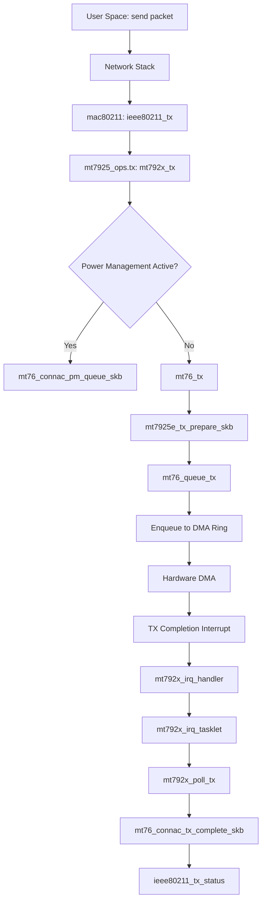
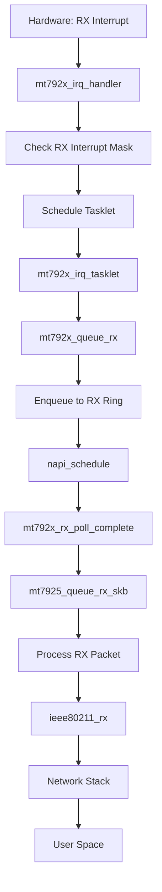
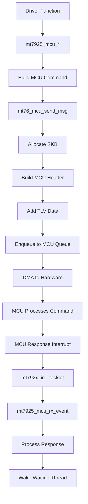
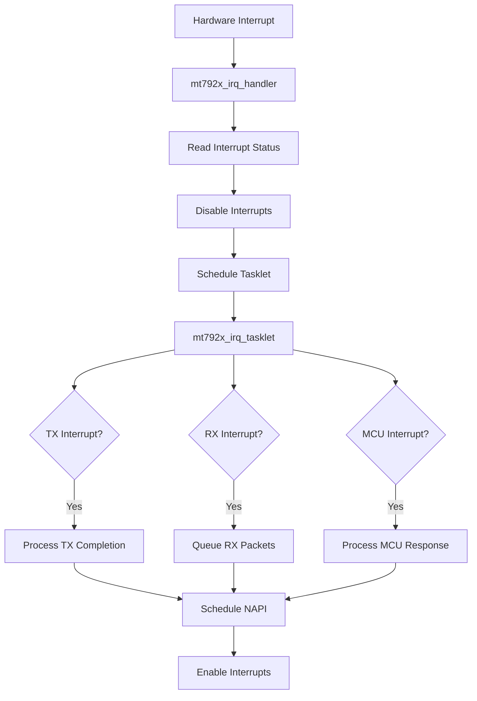
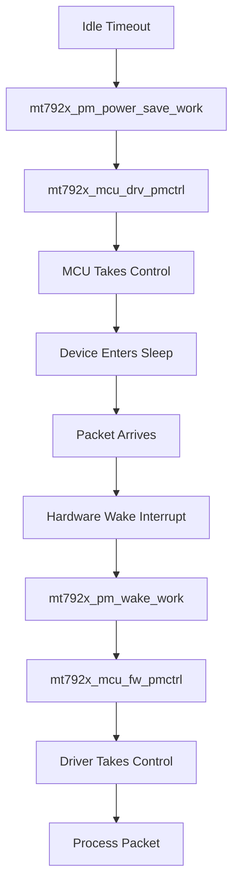

# Control Flow

## Overview

This document describes the control flows for packet transmission, reception, MCU communication, and interrupt handling in the MT7925 driver.

## Packet Transmission Flow

### Entry Point: `mt792x_tx()`

**Location:** `mt792x_core.c:80`

**Called by:** mac80211 when a packet needs to be transmitted

### Transmission Flow Diagram



### Detailed Steps

#### 1. TX Entry (`mt792x_tx:80`)

```c
void mt792x_tx(struct ieee80211_hw *hw, struct ieee80211_tx_control *control,
               struct sk_buff *skb)
```

**Key Operations:**
- Extract WCID (Wireless Client ID) from station or interface
- Handle MLO link selection
- Check power management state

**MLO Handling:**
```c
if (control->sta) {
    link_id = u32_get_bits(info->control.flags, IEEE80211_TX_CTRL_MLO_LINK);
    mlink = mt792x_sta_to_link(sta, link_id);
    if (!mlink)
        goto free_skb;  // Link not available
    wcid = &mlink->wcid;
}
```

**Critical:** NULL check for `mlink` prevents NULL pointer dereference (patch 0010).

#### 2. Power Management Check (`mt792x_tx:131`)

```c
if (mt76_connac_pm_ref(mphy, &dev->pm)) {
    mt76_tx(mphy, control->sta, wcid, skb);
    mt76_connac_pm_unref(mphy, &dev->pm);
    return;
}
```

**Purpose:** If device is awake, transmit immediately. Otherwise, queue for later.

#### 3. TX Preparation (`mt7925e_tx_prepare_skb`)

**Location:** Called from `mt76_tx()` via `drv_ops.tx_prepare_skb`

**Operations:**
- Build TX descriptor (TXD)
- Build TX power (TXP) header
- Set queue mapping
- Configure encryption if needed

#### 4. Queue to DMA Ring (`mt76_queue_tx`)

**Location:** `mt76/tx.c`

**Operations:**
- Enqueue SKB to appropriate TX queue (per-AC or MCU)
- Update queue head pointer
- Kick hardware if needed

**TX Queues:**
- `MT_TXQ_VO`, `MT_TXQ_VI`, `MT_TXQ_BE`, `MT_TXQ_BK` - Per-AC queues
- `MT_TXQ_MCU_WM`, `MT_TXQ_MCU_WA` - MCU queues
- `MT_TXQ_BEACON`, `MT_TXQ_CAB` - Management frames

#### 5. Hardware DMA

Hardware reads from DMA ring and transmits packet over air.

#### 6. TX Completion (`mt792x_poll_tx`)

**Location:** Called from NAPI poll

**Operations:**
- Process completed TX entries
- Update statistics
- Free TX descriptors
- Report status to mac80211

**Status Reporting:**
```c
mt76_connac_tx_complete_skb(mdev, wcid, skb);
ieee80211_tx_status(hw, skb);
```

## Packet Reception Flow

### Entry Point: Hardware Interrupt

### Reception Flow Diagram



### Detailed Steps

#### 1. Interrupt Handler (`mt792x_irq_handler`)

**Location:** `mt792x_dma.c:11`

```c
irqreturn_t mt792x_irq_handler(int irq, void *dev_instance)
{
    struct mt792x_dev *dev = dev_instance;
    u32 intr = mt76_rr(dev, dev->irq_map->host_irq_enable);
    
    mt76_wr(dev, dev->irq_map->host_irq_enable, 0);
    
    if (!test_bit(MT76_STATE_INITIALIZED, &dev->mphy.state))
        return IRQ_NONE;
    
    tasklet_schedule(&dev->mt76.irq_tasklet);
    
    return IRQ_HANDLED;
}
```

**Purpose:** Acknowledge interrupt and schedule bottom-half processing.

#### 2. Tasklet Processing (`mt792x_irq_tasklet`)

**Location:** `mt792x_dma.c:28`

**Operations:**
- Process TX completion interrupts
- Process RX data interrupts
- Process MCU response interrupts
- Schedule NAPI for RX processing

#### 3. RX Queue Processing (`mt792x_queue_rx`)

**Location:** `mt792x_dma.c`

**Operations:**
- Read RX descriptors from hardware
- Enqueue packets to RX ring
- Schedule NAPI poll

#### 4. NAPI Poll (`mt792x_rx_poll_complete`)

**Location:** Called from NAPI subsystem

**Operations:**
- Process RX ring entries
- Call `mt7925_queue_rx_skb()` for each packet
- Update NAPI budget

#### 5. RX Packet Processing (`mt7925_queue_rx_skb`)

**Location:** `mt7925/mac.c`

**Operations:**
- Parse RX descriptor
- Extract rate information
- Update statistics
- Handle aggregation
- Deliver to mac80211

**Key Processing:**
```c
// Extract RX descriptor fields
rxd = (struct mt7925_rxd *)skb->data;
chfreq = FIELD_GET(MT_RXD1_NORMAL_CH_FREQ, rxd[1]);
wcid = FIELD_GET(MT_RXD1_NORMAL_WLAN_IDX, rxd[1]);

// Update rate info
status.rate_idx = FIELD_GET(MT_RXD2_NORMAL_TX_RATE, rxd[2]);
status.band = chfreq > 14 ? NL80211_BAND_5GHZ : NL80211_BAND_2GHZ;

// Deliver to mac80211
ieee80211_rx(hw, &status, skb);
```

## MCU Communication Flow

### Overview

The MCU (Microcontroller Unit) is firmware running on the WiFi chip that handles:
- Station management
- Power management
- Regulatory domain handling
- Scan operations
- Firmware updates

### MCU Communication Flow Diagram



### Detailed Steps

#### 1. MCU Command Building

**Example: Station Add Command**

**Location:** `mt7925/mcu.c`

```c
int mt7925_mcu_sta_add(struct mt792x_dev *dev, struct ieee80211_vif *vif,
                       struct ieee80211_sta *sta, bool enable)
{
    struct sk_buff *skb;
    
    // Allocate SKB for MCU message
    skb = __mt76_connac_mcu_alloc_sta_req(&dev->mt76, &mconf->mt76,
                                          &mlink->wcid,
                                          MT7925_STA_UPDATE_MAX_SIZE);
    
    // Build TLV data
    mt7925_mcu_sta_basic_tlv(skb, vif, sta, enable);
    mt7925_mcu_sta_phy_tlv(skb, vif, sta);
    // ... more TLVs
    
    // Send command
    return mt76_mcu_skb_send_msg(&dev->mt76, skb,
                                MCU_WMWA_UNI_CMD(STA_REC_UPDATE), true);
}
```

**Critical:** All MCU operations must be protected by mutex:
```c
mt792x_mutex_acquire(dev);
ret = mt7925_mcu_sta_add(dev, vif, sta, true);
mt792x_mutex_release(dev);
```

#### 2. MCU Message Sending (`mt76_mcu_send_msg`)

**Location:** `mt76/mcu.c`

**Operations:**
- Allocate SKB if not provided
- Build MCU header (command ID, sequence number, length)
- Add TLV data
- Enqueue to MCU queue (`MT_MCUQ_WM` or `MT_MCUQ_WA`)
- Wait for response if `wait_resp` is true

**MCU Queues:**
- `MT_MCUQ_WM` - WM (Wireless MAC) commands
- `MT_MCUQ_WA` - WA (Wireless Assistant) commands
- `MT_MCUQ_FWDL` - Firmware download

#### 3. MCU Response Processing (`mt7925_mcu_rx_event`)

**Location:** `mt7925/mcu.c`

**Operations:**
- Parse MCU response header
- Extract event ID and sequence number
- Match response to pending command
- Wake waiting thread
- Process event data

**Response Matching:**
```c
// Find pending command by sequence number
skb = idr_find(&dev->mt76.mcu.res_q, seq);
if (skb) {
    // Process response
    mt76_mcu_parse_response(dev, cmd, skb, seq);
    // Wake waiting thread
    wake_up(&dev->mt76.mcu.wait);
}
```

#### 4. MCU Timeout Handling

**Location:** `mt76/mcu.c`

If MCU doesn't respond within timeout:
- Log error: `"Message %04x (seq %d) timeout"`
- Retry if configured
- Return error to caller

**Common Timeouts:**
- Station management: 3 seconds
- Firmware operations: 5 seconds
- Power management: 1 second

## Interrupt Handling Flow

### Interrupt Types

1. **TX Completion Interrupts**
   - Per-AC TX done
   - MCU TX done

2. **RX Data Interrupts**
   - Main data RX
   - MCU response RX

3. **Other Interrupts**
   - Hardware errors
   - Power management events

### Interrupt Flow



### Tasklet Processing (`mt792x_irq_tasklet`)

**Location:** `mt792x_dma.c:28`

```c
void mt792x_irq_tasklet(unsigned long data)
{
    struct mt792x_dev *dev = (struct mt792x_dev *)data;
    struct mt76_dev *mdev = &dev->mt76;
    u32 intr, mask = dev->irq_map->host_irq_enable;
    
    mt76_wr(dev, MT_INT_MASK_CSR, 0);
    
    intr = mt76_rr(dev, MT_INT_SOURCE_CSR);
    intr &= dev->mt76.mmio.irqmask;
    mt76_wr(dev, MT_INT_SOURCE_CSR, intr);
    
    if (intr & dev->irq_map->tx.all_complete_mask)
        napi_schedule(&dev->mt76.tx_napi);
    
    if (intr & dev->irq_map->rx.data_complete_mask)
        napi_schedule(&dev->mt76.napi[MT_RXQ_MAIN]);
    
    if (intr & dev->irq_map->rx.wm_complete_mask)
        napi_schedule(&dev->mt76.napi[MT_RXQ_MCU]);
    
    mt76_wr(dev, MT_INT_MASK_CSR, mask);
}
```

## Power Management Flow

### Runtime PM Flow



### Suspend/Resume Flow

**Suspend Entry:** `mt7925_pci_suspend()`

**Location:** `mt7925/pci.c:443`

**Operations:**
1. Cancel work queues
2. Abort ROC (Remain-on-Channel)
3. Transfer control to MCU
4. Disable interrupts
5. Save device state

**Resume Entry:** `mt7925_pci_resume()`

**Operations:**
1. Enable interrupts
2. Transfer control from MCU
3. Restore device state
4. Resume work queues

## Work Queue Flows

### Reset Work Flow

**Entry:** `mt7925_mac_reset_work()`

**Location:** `mt7925/mac.c`

**Triggered by:**
- Firmware assertion
- MCU timeout
- Hardware error

**Operations:**
1. Stop TX/RX
2. Reset hardware
3. Reload firmware
4. Reconnect interfaces

### Scan Work Flow

**Entry:** `mt7925_scan_work()`

**Location:** `mt7925/main.c`

**Operations:**
1. Process scan events from MCU
2. Update scan results
3. Notify mac80211

## Related Documentation

- [ENTRY_POINTS.md](ENTRY_POINTS.md) - Initialization flows
- [MCU_PROTOCOL.md](MCU_PROTOCOL.md) - MCU communication protocol details
- [KERNEL_INTERACTIONS.md](KERNEL_INTERACTIONS.md) - Kernel subsystem integration

