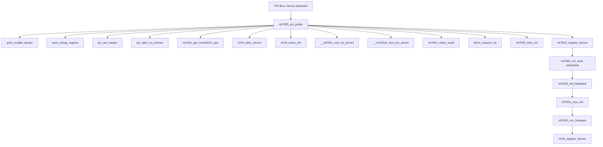
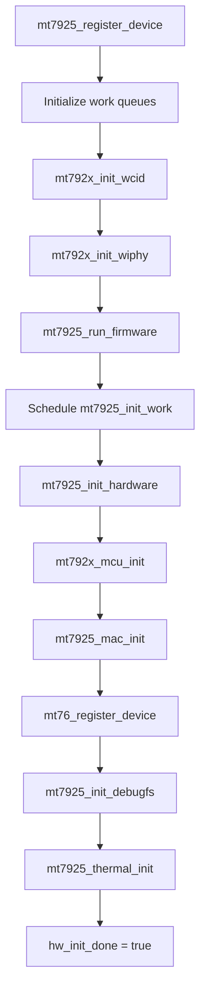
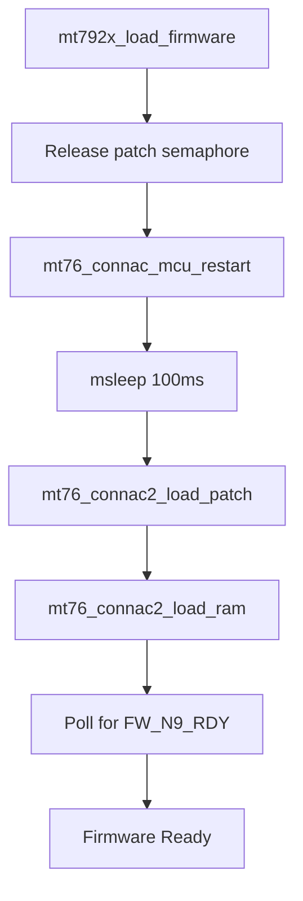

# Entry Points and Initialization

## Overview

This document describes the entry points and initialization sequence for the MT7925 driver. Understanding these flows is critical for debugging initialization failures and understanding how the driver integrates with the kernel.

## PCI Device Initialization

### Entry Point: `mt7925_pci_probe()`

**Location:** `mt7925/pci.c:268`

**Function Signature:**
```c
static int mt7925_pci_probe(struct pci_dev *pdev,
                            const struct pci_device_id *id)
```

### Initialization Flow



### Step-by-Step Breakdown

#### 1. PCI Setup (`mt7925_pci_probe:316-329`)

```c
// Enable PCI device
ret = pcim_enable_device(pdev);

// Map MMIO regions
ret = pcim_iomap_regions(pdev, BIT(0), pci_name(pdev));

// Enable bus mastering
pci_set_master(pdev);
```

**Purpose:** Enable PCI device and map memory-mapped I/O regions for register access.

#### 2. IRQ Allocation (`mt7925_pci_probe:331`)

```c
ret = pci_alloc_irq_vectors(pdev, 1, 1, PCI_IRQ_ALL_TYPES);
```

**Purpose:** Allocate MSI/MSI-X interrupt vectors for hardware interrupts.

#### 3. mac80211 Operations Setup (`mt7925_pci_probe:342`)

```c
ops = mt792x_get_mac80211_ops(&pdev->dev, &mt7925_ops,
                              (void *)id->driver_data, &features);
```

**Purpose:** Get mac80211 operations structure. The `mt7925_ops` structure (defined in `mt7925/main.c:2240`) contains all the callbacks that mac80211 will call.

#### 4. Device Allocation (`mt7925_pci_probe:349`)

```c
mdev = mt76_alloc_device(&pdev->dev, sizeof(*dev), ops, &drv_ops);
dev = container_of(mdev, struct mt792x_dev, mt76);
```

**Purpose:** Allocate the core `mt76_dev` structure, which contains the `mt792x_dev` structure.

**Key Structures:**
- `struct mt76_dev` - Core device (allocated)
- `struct mt792x_dev` - MT792x device (container_of from mt76_dev)

#### 5. MMIO Initialization (`mt7925_pci_probe:361`)

```c
mt76_mmio_init(&dev->mt76, pcim_iomap_table(pdev)[0]);
```

**Purpose:** Initialize memory-mapped I/O operations for register access.

#### 6. Power Management Control (`mt7925_pci_probe:383-389`)

```c
ret = __mt792x_mcu_fw_pmctrl(dev);  // Firmware takes control
ret = __mt792xe_mcu_drv_pmctrl(dev); // Driver takes control
```

**Purpose:** Transfer power management control from firmware to driver.

#### 7. Hardware Reset (`mt7925_pci_probe:398`)

```c
ret = mt792x_wfsys_reset(dev);
```

**Purpose:** Reset the WiFi system (WFSYS) to a known state.

#### 8. IRQ Handler Registration (`mt7925_pci_probe:406`)

```c
ret = devm_request_irq(mdev->dev, pdev->irq, mt792x_irq_handler,
                       IRQF_SHARED, KBUILD_MODNAME, dev);
```

**Purpose:** Register interrupt handler for hardware interrupts.

**Handler:** `mt792x_irq_handler()` processes:
- TX completion interrupts
- RX data interrupts
- MCU response interrupts

#### 9. DMA Initialization (`mt7925_pci_probe:411`)

```c
ret = mt7925_dma_init(dev);
```

**Purpose:** Initialize DMA ring buffers for TX/RX and MCU communication.

#### 10. Device Registration (`mt7925_pci_probe:415`)

```c
ret = mt7925_register_device(dev);
```

This triggers the full initialization sequence (see below).

## Device Registration Flow

### Entry Point: `mt7925_register_device()`

**Location:** `mt7925/init.c:341`

### Initialization Sequence



### Detailed Steps

#### 1. Work Queue Initialization (`mt7925_register_device:349-374`)

```c
dev->mt76.tx_worker.fn = mt792x_tx_worker;
INIT_WORK(&dev->init_work, mt7925_init_work);
INIT_WORK(&dev->reset_work, mt7925_mac_reset_work);
// ... more work queues
```

**Purpose:** Initialize work queues for deferred processing.

#### 2. WCID Initialization (`mt7925_register_device:391`)

```c
ret = mt792x_init_wcid(dev);
```

**Purpose:** Initialize Wireless Client ID (WCID) table. WCIDs are used to identify stations and interfaces in hardware.

#### 3. Wiphy Initialization (`mt7925_register_device:395`)

```c
ret = mt792x_init_wiphy(hw);
```

**Purpose:** Initialize `struct wiphy` (wireless PHY) with supported bands, channels, rates, and capabilities.

#### 4. Firmware Loading (`mt7925_register_device:399`)

```c
ret = mt7925_run_firmware(dev);
```

This calls:
- `mt792x_load_firmware()` - Loads firmware (see below)
- `mt7925_mcu_get_nic_capability()` - Gets NIC capabilities

#### 5. Schedule Initialization Work (`mt7925_register_device:410`)

```c
schedule_work(&dev->init_work);
```

**Purpose:** Schedule deferred initialization work. This allows the probe function to return quickly.

## Firmware Loading Flow

### Entry Point: `mt792x_load_firmware()`

**Location:** `mt792x_core.c:935`

### Loading Sequence



### Detailed Steps

#### 1. Semaphore Release (`mt792x_core.c:943`)

```c
ret = mt76_connac_mcu_patch_sem_ctrl(&dev->mt76, false);
```

**Purpose:** Release patch semaphore if held by a previous failed load attempt. This is critical for recovery after crashes (see patch 0015).

#### 2. MCU Restart (`mt792x_core.c:948`)

```c
mt76_connac_mcu_restart(&dev->mt76);
```

**Purpose:** Restart MCU to ensure clean state before loading firmware.

#### 3. Load ROM Patch (`mt792x_core.c:953`)

```c
ret = mt76_connac2_load_patch(&dev->mt76, mt792x_patch_name(dev));
```

**Purpose:** Load ROM patch firmware. The patch updates the ROM firmware with bug fixes and new features.

**Firmware Files:**
- MT7925: `mediatek/mt7925/WIFI_MT7925_PATCH_MCU_1_1_hdr.bin`

#### 4. Load RAM Firmware (`mt792x_core.c:964`)

```c
ret = mt76_connac2_load_ram(&dev->mt76, mt792x_ram_name(dev), NULL);
```

**Purpose:** Load RAM firmware. This is the main firmware that runs on the MCU.

**Firmware Files:**
- MT7925: `mediatek/mt7925/WIFI_RAM_CODE_MT7925_1_1.bin`

#### 5. Wait for Firmware Ready (`mt792x_core.c:968`)

```c
if (!mt76_poll_msec(dev, MT_CONN_ON_MISC, MT_TOP_MISC2_FW_N9_RDY,
                    MT_TOP_MISC2_FW_N9_RDY, 1500))
    return -EIO;
```

**Purpose:** Poll hardware register to confirm firmware is ready. Timeout is 1500ms.

## Hardware Initialization Flow

### Entry Point: `mt7925_init_work()`

**Location:** `mt7925/init.c:290`

This work function is scheduled after firmware loading completes.

### Initialization Steps

#### 1. Hardware Init (`mt7925_init_work:296`)

```c
ret = mt7925_init_hardware(dev);
```

This calls `__mt7925_init_hardware()` which:
- `mt792x_mcu_init()` - Initialize MCU communication
- `mt76_eeprom_override()` - Load EEPROM data
- `mt7925_mcu_set_eeprom()` - Send EEPROM to firmware
- `mt7925_mac_init()` - Initialize MAC layer

#### 2. Stream Caps (`mt7925_init_work:300`)

```c
mt76_set_stream_caps(&dev->mphy, true);
mt7925_set_stream_he_eht_caps(&dev->phy);
```

**Purpose:** Configure stream capabilities (MIMO, HE, EHT).

#### 3. MAC Address List (`mt7925_init_work:302`)

```c
mt792x_config_mac_addr_list(dev);
```

**Purpose:** Configure MAC address list for MLO (up to 8 addresses).

#### 4. MLO Initialization (`mt7925_init_work:304`)

```c
ret = mt7925_init_mlo_caps(&dev->phy);
```

**Purpose:** Initialize Multi-Link Operation capabilities.

#### 5. Register with mac80211 (`mt7925_init_work:310`)

```c
ret = mt76_register_device(&dev->mt76, true, mt76_rates,
                           ARRAY_SIZE(mt76_rates));
```

**Purpose:** Register the device with mac80211. This makes the interface visible to userspace.

#### 6. Debugfs (`mt7925_init_work:317`)

```c
ret = mt7925_init_debugfs(dev);
```

**Purpose:** Create debugfs entries for debugging.

#### 7. Thermal Management (`mt7925_init_work:323`)

```c
ret = mt7925_thermal_init(&dev->phy);
ret = mt7925_mcu_set_thermal_protect(dev);
```

**Purpose:** Initialize thermal monitoring and protection.

#### 8. Mark Initialization Complete (`mt7925_init_work:336`)

```c
dev->hw_init_done = true;
```

**Purpose:** Mark hardware initialization as complete. This enables chip reset functionality.

## USB Device Initialization

### Entry Point: `mt7925u_probe()`

**Location:** `mt7925/usb.c:132`

The USB initialization flow is similar to PCI but uses USB bus operations instead of MMIO.

**Key Differences:**
- Uses `usb_register_driver()` instead of `pci_register_driver()`
- Uses USB control transfers for register access
- No MMIO mapping

## Module Initialization

### Module Entry Points

**PCI Driver:**
```c
module_pci_driver(mt7925_pci_driver);
```

**USB Driver:**
```c
module_usb_driver(mt7925u_driver);
```

**Module Parameters:**
- `disable_aspm` (bool) - Disable PCI ASPM support

## mac80211 Operations Registration

### Operations Structure

**Location:** `mt7925/main.c:2240`

```c
const struct ieee80211_ops mt7925_ops = {
    .tx = mt792x_tx,
    .start = mt7925_start,
    .stop = mt792x_stop,
    .config = mt7925_config,
    .add_interface = mt792x_add_interface,
    .remove_interface = mt792x_remove_interface,
    .configure_filter = mt7925_configure_filter,
    .sta_add = mt7925_mac_sta_add,
    .sta_remove = mt7925_mac_sta_remove,
    // ... more operations
};
```

**Key Operations:**
- `.start` - Called when interface is brought up
- `.tx` - Packet transmission entry point
- `.config` - Channel/bandwidth configuration
- `.add_interface` - Virtual interface creation
- `.sta_add` - Station association

See [CONTROL_FLOW.md](CONTROL_FLOW.md) for details on how these operations are called.

## Initialization Error Handling

### Retry Logic

**MCU Initialization Retry (`mt7925_init_hardware:274`):**
```c
for (i = 0; i < MT792x_MCU_INIT_RETRY_COUNT; i++) {
    ret = __mt7925_init_hardware(dev);
    if (!ret)
        break;
    mt792x_init_reset(dev);  // Reset and retry
}
```

**Purpose:** Retry hardware initialization up to 10 times if MCU init fails.

### Common Failure Points

1. **Firmware Loading Failure:**
   - Missing firmware file
   - Firmware timeout (1500ms)
   - Semaphore timeout

2. **MCU Initialization Failure:**
   - MCU communication timeout
   - EEPROM read failure

3. **DMA Initialization Failure:**
   - Ring buffer allocation failure
   - Register access failure

## Device Removal

### Entry Point: `mt7925_pci_remove()`

**Location:** `mt7925/pci.c:431`

**Removal Sequence:**
1. Unregister device from mac80211
2. Disable NAPI
3. Cancel work queues
4. Release MCU control
5. Cleanup DMA
6. Free IRQ
7. Free device structure

## Related Documentation

- [ARCHITECTURE.md](ARCHITECTURE.md) - Module architecture overview
- [CONTROL_FLOW.md](CONTROL_FLOW.md) - Runtime control flows
- [KERNEL_INTERACTIONS.md](KERNEL_INTERACTIONS.md) - Kernel subsystem integration

